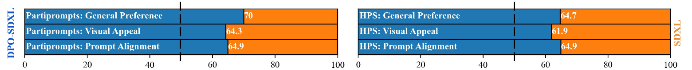
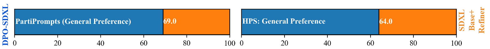

### Diffusion Model Alignment Using Direct Preference Optimization
> https://github.com/SalesforceAIResearch/DiffusionDPO

#### 研究背景与问题
当前大语言模型（LLM）通过RLHF方法利用人类偏好数据进行对齐优化，但扩散模型在偏好学习上进展有限。现有方法如微调高质量数据（如Emu模型）或基于RL的方法（如DPOK/DDPO）存在以下问题：
1. **开放词汇泛化能力差**：RL方法在有限提示集上有效，但扩展到开放词汇时性能下降。
2. **模式崩溃**：如AlignProp通过奖励梯度直接优化易导致生成多样性下降。

#### 贡献
1. **提出Diffusion-DPO方法**  
   将DPO框架扩展到扩散模型，通过以下：
   - **重新参数化扩散路径的似然**：利用（ELBO）将扩散模型的逆过程建模为马尔可夫链，推导出基于KL散度的优化目标：
     $$
     \max_{p_\theta} \mathbb{E}[r(c,x_0)] - \beta \mathbb{D}_{\text{KL}}(p_\theta(x_{0:T}|c) \| p_{\text{ref}}(x_{0:T}|c))
     $$
     $$
     \mathcal{L} = -\mathbb{E} \log \sigma (\beta \mathbb{E}[\log \frac{p_\theta(x_{0:T}^w)}{p_{ref}(x_{0:T}^w)} - \log \frac{p_\theta(x_{0:T}^l)}{p_{ref}(x_{0:T}^l)}])
     $$
   - **简化的可微损失函数**：通过Jensen不等式，将损失函数转化为：
     $$
     \mathcal{L} = -\mathbb{E} \log \sigma (-\beta T \omega(\lambda_t) \left[ \|\epsilon^w - \epsilon_\theta(x_t^w,t)\|^2 - \|\epsilon^w - \epsilon_{\text{ref}}(x_t^w,t)\|^2 - (\|\epsilon^l - \epsilon_\theta(x_t^l,t)\|^2 - \|\epsilon^l - \epsilon_{\text{ref}}(x_t^l,t)\|^2) \right])
     $$
   - 推导证明DDPO和DPOK是算法框架的特例，而且是作为off-policy algo

2. **实现开放词汇下的高效对齐**  
   - 通过直接对比偏好数据对（$x_0^w, x_0^l$），避免RL方法的轨迹采样复杂度，支持大规模开放提示集训练。
   - 引入KL正则项（超参$\beta$控制），平衡奖励最大化和分布偏移风险。

3. **验证多场景有效性**  
   - **人类偏好数据训练**：使用Pick-a-Pic数据集（851K对）微调SDXL，在PartiPrompts和HPSv2基准上，人类评估偏好率超过基准模型（SDXL+Refiner）。
   - **AI反馈训练**：利用PickScore和CLIP等自动评分模型生成伪偏好数据，性能接近人类反馈（63.3%胜率）。

#### 实验与结果
1. **评估指标**  
   - **自动指标**：PickScore（人类偏好预测模型）for validation；Partiprompt和HPSv2 benchmarks for final test。
   - **人工评估**：从视觉吸引力（Q2）、文本对齐（Q3）和综合偏好（Q1）三个维度进行评分。  
      > Five responses are collected for each comparison with majority vote (3+) being considered the collective decision
     - Q1 General Preference (Which image do you prefer given the prompt?)
     - Q2 Visual Appeal (prompt not considered) (Which image is more visually appealing?)
     - Q3 Prompt Alignment (Which image better fits the text description?)

2. **主要结果**  
   - DPO-SDXL在PartiPrompts上Q1胜率70%；在HPSv2上Q1胜率64.7%
   
   - 图像编辑任务（on TEd-Bench）中，DPO模型在65%的案例中更受偏好。
   