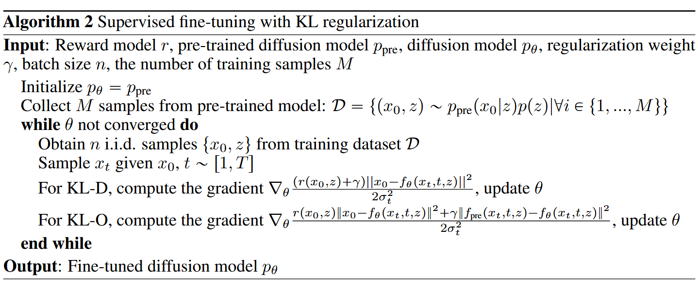

### DPOK: Reinforcement Learning for Fine-tuning Text-to-Image Diffusion Models
> https://github.com/google-research/google-research/tree/master/dpok

apply LoRA to the UNet module to fine-tune Stable Diffusion v1.5 using **ImageReward**
#### 贡献
1. **DPOK算法框架**  
   提出**基于KL正则化的扩散策略优化方法**，首次将在线强化学习（RL）引入文本-图像扩散模型的微调。通过构建马尔可夫决策过程（MDP），将扩散模型的去噪过程转化为多步决策问题，利用策略梯度最大化人类反馈奖励，同时通过关于原始pre-trained model的KL散度约束模型不过度偏离预训练分布。

2. **KL正则化的理论分析**  
   - **RL微调**：证明了条件KL散度的上界（原论文Lemma 4.2），提出在目标函数中引入KL正则项：
     $$
     \mathbb{E}_{p(z)}\left[\alpha \mathbb{E}_{p_\theta(x_{0:T}|z)}[-r(x_0,z)] + \beta \sum_{t=1}^T \mathbb{E}_{p_\theta(x_t|z)}\left[\text{KL}(p_\theta(x_{t-1}|x_t,z) \| p_{\text{pre}}(x_{t-1}|x_t,z))\right]\right]
     $$
     通过策略梯度更新实现联合优化奖励与模型稳定性。
   - **监督微调改进**：提出两种KL正则化变体（KL-D与KL-O）
   

3. **在线RL与监督微调的差异**  
   - **样本分布**：在线RL优化生成分布，监督微调依赖预训练分布。
   - **KL正则化应用**：在线KL通过当前策略样本计算，监督KL仅基于固定数据集。
   - **奖励泛化性**：在线方法利用奖励模型对新样本的泛化能力。

---

#### 方法细节
1. **MDP形式化**  
   将扩散过程建模为$T$步MDP：
   - **状态**：$s_t = (z, x_{T-t})$（文本提示$z$与隐变量$x_{T-t}$）
   - **动作**：$a_t = x_{T-t-1}$（下一扩散状态）
   - **奖励**：仅在最终步赋予图像-文本对齐奖励$r(x_0,z)$

2. **策略梯度优化**  
   通过策略梯度推导目标函数梯度：
   $$
   \nabla_\theta \mathbb{E}[-r] = \mathbb{E}\left[-r \sum_{t=1}^T \nabla_\theta \log p_\theta(x_{t-1}|x_t,z)\right]
   $$
   结合KL正则化后，梯度更新包含奖励项与KL项。

3. **KL正则化实现**  
   - **在线RL**：通过上界约束将KL散度分解为各时间步条件KL的加权和。
   - **监督微调**：
     - **KL-D**：调整奖励权重为$(r+\gamma)$，引导模型靠近预训练分布。
     - **KL-O**：增加$L_2$正则项约束去噪方向。