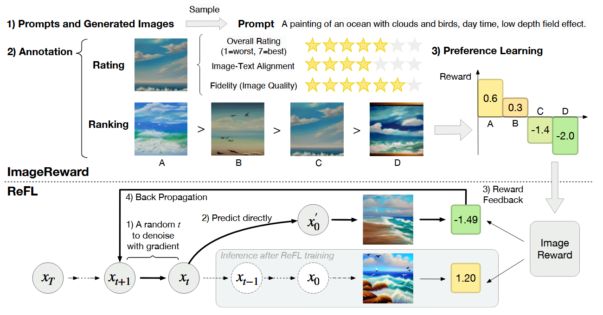
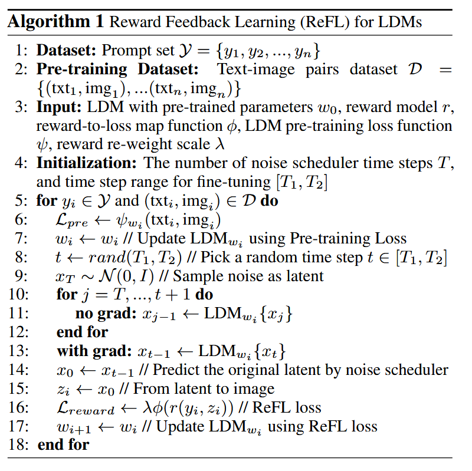

### ImageReward: Learning and Evaluating Human Preferences for Text-to-Image Generation
> https://github.com/THUDM/ImageReward

#### Motivation
Existing **self-supervised pre-trained** generators are far from perfect.  
A primary challenge lies in **aligning models with human preference**, as the pre-training distribution is noisy and differs from the actual user-prompt distributions.

#### Framework

#### 核心贡献
1. **系统化人类偏好标注框架与数据集构建**
   - 设计了包含提示标注、图像评分和排序的三阶段标注流程，构建了包含137k对对比样本的数据集。
   - 标注标准涵盖文本对齐度、保真度、无害性等多维度评价，并制定冲突解决规则（如毒性内容优先过滤）。

2. **通用人类偏好奖励模型ImageReward**
   - 采用BLIP作为主干网络（优于CLIP），通过对比学习建模人类偏好：
     $$
     \text{loss}(\theta) = -\mathbb{E}_{(T,x_i,x_j)\sim\mathcal{D}} \left[ \log \sigma(f_\theta(T,x_i) - f_\theta(T,x_j)) \right]
     $$
     其中 $f_\theta(T,x)$ 为奖励模型对提示词 \( T \) 和图像 \( x \) 的评分。  
     $k \in [4,9],x_i,x_j \in \{x_1, x_2, ... ,x_k\}$ and $x_i$ is better than $x_j$

3. **提出Reward Feedback Learning (ReFL)算法**
   - 关键insight：去噪过程后期（第30-40步）的图像质量与最终奖励显著相关。
   
   - 算法设计：在随机选择的后期步骤 $t \in [30,40]$ 注入奖励反馈，结合预训练损失：
     $$
     \mathcal{L}_{\text{reward}} = \lambda \mathbb{E}_{y_i \sim \mathcal{Y}} \left[ \phi(r(y_i, g_\theta(y_i))) \right]
     $$
     $$
     \mathcal{L}_{\text{pre}} = \mathbb{E}_{(y_i,x_i)\sim\mathcal{D}} \left[ \|\epsilon - \epsilon_\theta(z_t, t, \tau_\theta(y_i))\|_2^2 \right]
     $$
   - 超参数：$\phi = ReLU, λ = 1e − 3, T = 40, [T1, T2] = [1, 10]$