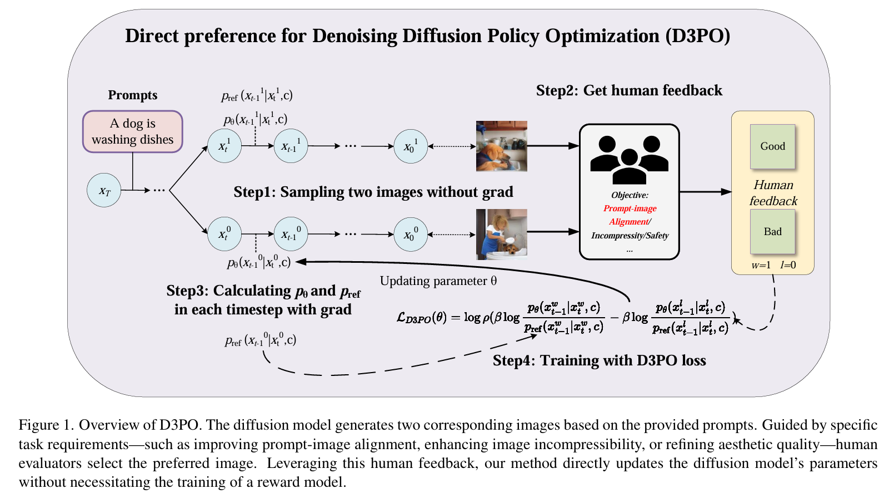
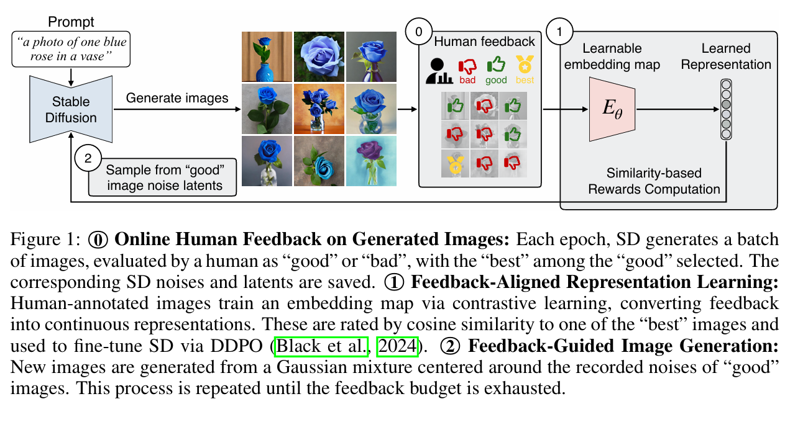
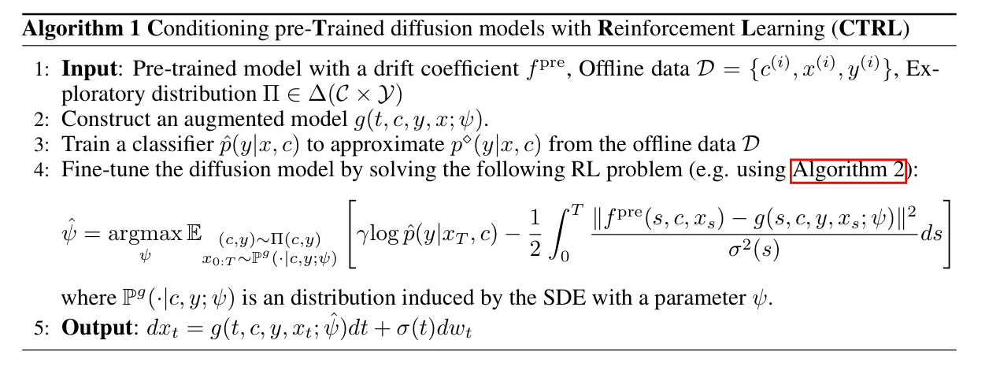

### Using Human Feedback to Fine-tune Diffusion Models without Any Reward Model
> Using reinforcement learning with human feedback (RLHF) has shown significant promise in fine-tuning diffusion models. Previous methods start by training a reward model that aligns with human preferences, then leverage RL techniques to fine-tune the underlying models. However, crafting an efficient reward model demands extensive datasets, optimal architecture, and manual hyperparameter tuning, making the process both time and cost-intensive. The direct preference optimization (DPO) method, effective in fine-tuning large language models, eliminates the necessity for a reward model. However, the extensive GPU memory requirement of the diffusion model’s denoising process hinders the direct application of the DPO method. To address this issue, we introduce the Direct Preference for Denoising Diffusion Policy Optimization (D3PO) method to directly fine-tune diffusion models. The theoretical analysis demonstrates that although D3PO omits training a reward model, it effectively functions as the optimal reward model trained using human feedback data to guide the learning process. This approach requires no training of a reward model, proving to be more direct, costeffective, and minimizing computational overhead. In experiments, our method uses the relative scale of objectives as a proxy for human preference, delivering comparable results to methods using ground-truth rewards. Moreover, D3PO demonstrates the ability to reduce image distortion rates and generate safer images, overcoming challenges lacking robust reward models. Our code is publicly available at https://github.com/yk7333/D3PO.

###  HERO: HUMAN-FEEDBACK-EFFICIENT REINFORCEMENT LEARNING FOR ONLINE DIFFUSION MODEL FINETUNING
>  Controllable generation through Stable Diffusion (SD) fine-tuningaims to improve fidelity, safety, and alignment with human guidance. Existingreinforcement learning from human feedback methods usually rely on predefinedheuristic reward functions or pretrained reward models built on large-scaledatasets, limiting their applicability to scenarios where collecting such data iscostly or difficult. To effectively and efficiently utilize human feedback, we develop aframework, HERO, which leverages online human feedback collected on the fly duringmodel learning. Specifically, HERO features two key mechanisms: (1)Feedback-Aligned Representation Learning, an online training method that captures humanfeedback and provides informative learning signals for fine-tuning, and (2)FeedbackGuided Image Generation, which involve generating images from SD’srefined initialization samples, enabling faster convergence towards theevaluator’s intent. Wedemonstrate that HERO is 4ˆ more efficient in online feedback forbody part anomaly correction compared to the best existing method. Additionally,experiments show that HERO can effectively handle tasks like reasoning,counting, personalization, and reducing NSFW content with only 0.5K online feedback.The code and project page are available at https://hero-dm.github.io/.

###  ADDING CONDITIONAL CONTROL TO DIFFUSION MODELS WITH REINFORCEMENT LEARNING
> Diffusion models are powerful generative models that allow for precisecontrol over the characteristics of the generated samples. While these diffusionmodels trained on large datasets have achieved success, there is often a need tointroduce additional controls in downstream fine-tuning processes, treating these powerfulmodels as pre-trained diffusion models. This work presents a novel method basedon reinforcement learning (RL) to add such controls using an offline datasetcomprising inputs and labels. We formulate this task as an RL problem, with theclassifier learned from the offline dataset and the KL divergence againstpre-trained models serving as the reward functions. Our method, CTRL (Conditioningpre-Trained diffusion models with Reinforcement Learning), produces soft-optimalpolicies that maximize the abovementioned reward functions. We formally demonstratethat our method enables sampling from the conditional distribution withadditional controls during inference. Our RL-based approach offers several advantages overexisting methods. Compared to classifier-free guidance, it improves sampleefficiency and can greatly simplify dataset construction by leveraging conditionalindependence between the inputs and additional controls. Additionally, unlikeclassifier guidance, it eliminates the need to train classifiers from intermediate states toadditional controls. The code is available at https://github.com/zhaoyl18/CTRL.

